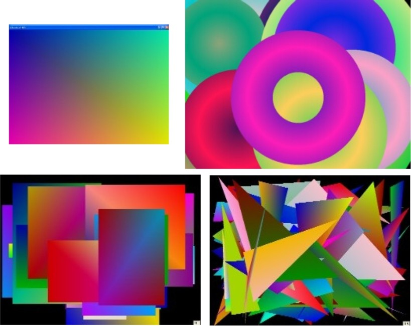



## Gradient Combo

### Description

Version 1.1.0 has an updated Speed Control. The original version was incorrectly set in the center of the bar no matter what the speed was. Version 1.1.0 fixes that bug. (May 27,2005)

GradientCombo has 4 different Gradient displays:

GradientCombo has 4 different Gradient displays:

1 - Full Screen Gradient

2 - Smaller rectangular Gradients

3 - Gradient Circles

4 - Gradient Triangles

You may set each displays Speed and Run Time without affecting the other displays. Click the Right Mouse button to open the Set-up Menu. I have included a Set-up file called "Grad_Comb.Ini". It is a Text file, so you may read or edit it with any word processor, such as WordPad or NotePad. It just saves your settings so you don't have to re-enter them each time you run the program.

You may also Click the Left Mouse button to Freeze or Thaw the display, depending on the current screen status.
 
### More Info
 
Nice looking random Gradient graphics.

             |
---                |---
**Submitted On**   |2005-05-27 18:49:26
**By**             |[Randy Giese](https://github.com/Planet-Source-Code/PSCIndex/blob/master/ByAuthor/randy-giese.md)
**Level**          |Intermediate
**User Rating**    |5.0 (20 globes from 4 users)
**Compatibility**  |VB 6\.0
**Category**       |[Graphics](https://github.com/Planet-Source-Code/PSCIndex/blob/master/ByCategory/graphics__1-46.md)
**World**          |[Visual Basic](https://github.com/Planet-Source-Code/PSCIndex/blob/master/ByWorld/visual-basic.md)
**Archive File**   |[Gradient\_C1893675272005\.zip](https://github.com/Planet-Source-Code/randy-giese-gradient-combo__1-60643/archive/master.zip)

